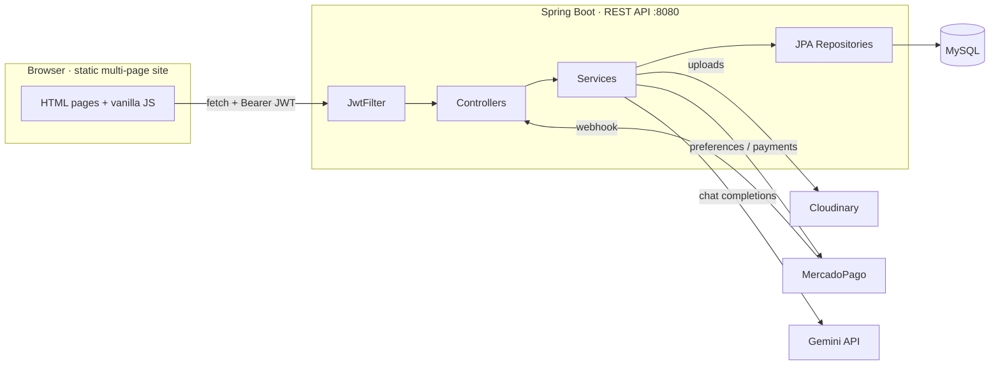
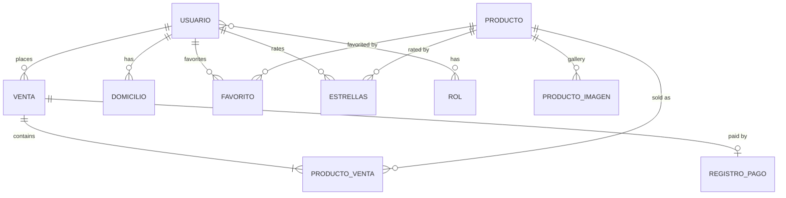
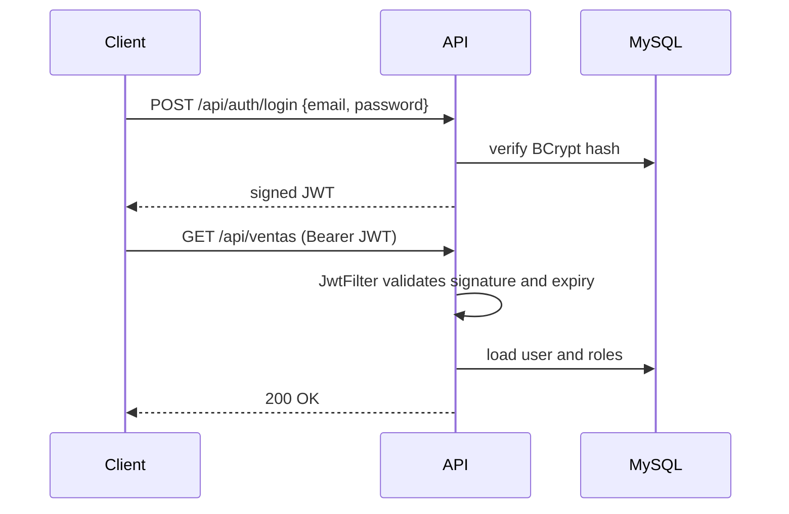
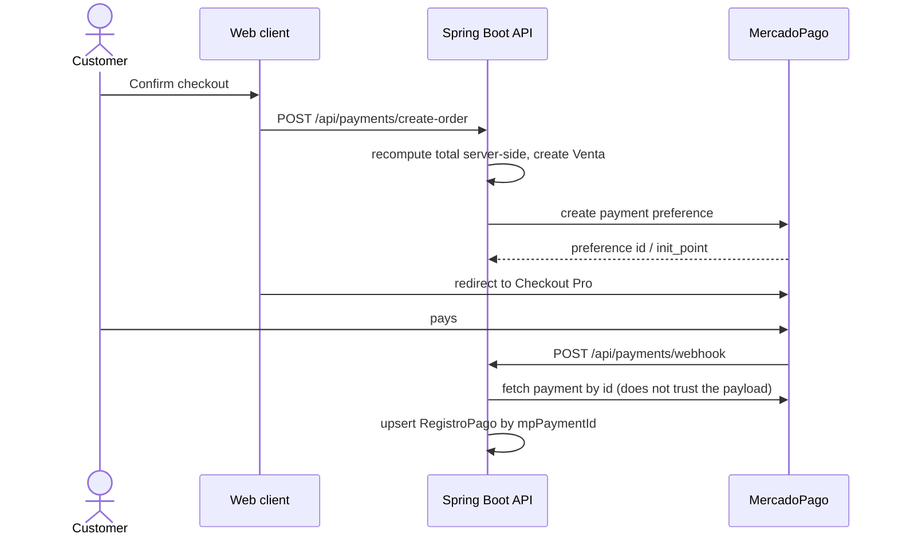

# 🛒 Yacomo — E-Commerce Platform

**Full-stack e-commerce: Spring Boot REST API with JWT authentication, MySQL persistence via JPA/Hibernate, Envers-audited products, MercadoPago checkout, Cloudinary media, a Gemini-powered chatbot, server-side PDF receipts, and a plain HTML/CSS/vanilla-JS storefront.**


**Live:** https://proyecto-yacomo.vercel.app

## Contents

- [Overview](#overview)
- [Features](#features)
- [Tech stack](#tech-stack)
- [Architecture](#architecture)
- [Domain model](#domain-model)
- [Authentication and authorization](#authentication-and-authorization)
- [Payments with MercadoPago](#payments-with-mercadopago)
- [Auditing with Envers](#auditing-with-envers)
- [Getting started](#getting-started)
- [Environment variables](#environment-variables)
- [Testing](#testing)
- [Project structure](#project-structure)
- [Known limitations](#known-limitations)

---

## Overview

Yacomo is an e-commerce backend with a plain, no-framework storefront on top of it. A customer browses products, rates them, favorites them, checks out through MercadoPago, and can ask a Gemini-backed chatbot about the catalog. An admin manages products, images, and users from the same site, and can pull the full edit history of any product because `Producto` is audited with Hibernate Envers.

The repository holds two independent applications:

| App | Path | Stack |
| --- | --- | --- |
| REST API | `Backend/BackendE_Commerce/` | Java 21, Spring Boot 3.5, Spring Data JPA, MySQL |
| Web client | `Frontend/` | Static multi-page site: plain HTML, CSS, vanilla JS (no framework, no bundler) |

> [!NOTE]
> **MongoDB is configured but unused.** `build.gradle` includes `spring-boot-starter-data-mongodb` and `application.properties` sets a `spring.data.mongodb.uri`, but there is no `@Document` class, Mongo repository, or `MongoTemplate` call anywhere in the codebase. All persistence goes through JPA/MySQL. The chatbot even keeps its conversation history in an in-memory `ConcurrentHashMap`, not in Mongo. Treat the Mongo dependency as dead weight until it's actually used for something.

---

## Features

**Storefront**

- Product catalog with images stored on Cloudinary, star ratings, and a favorites (wishlist) list — each tied to the logged-in user.
- A Gemini-backed chatbot (`gemini-2.5-flash`) that answers product questions.
- Server-side PDF purchase receipts (see [PDF receipts](#getting-started)) generated with OpenPDF.

**Checkout and payments**

- MercadoPago Checkout Pro: the order total is computed server-side before a payment preference is created, so the browser never dictates what gets charged.
- The webhook re-fetches the payment from MercadoPago by ID rather than trusting the notification payload, and upserts by `mpPaymentId`, so redelivered webhook events don't create duplicate payment records.

**Back office**

- Admin-only product CRUD, product image management, and user management, gated by `ROLE_ADMIN`.
- Full edit history for any product via Envers (`/api/productos/auditoria/**`): who changed what, and the state of a product at a given point in time.

**Security**

- Stateless authentication with JWTs signed with HS256 (`jjwt`).
- Passwords hashed with BCrypt.
- Two roles, `USER` and `ADMIN`, seeded on startup along with a default admin account.
- Bean Validation on request DTOs.

> [!WARNING]
> Two gaps worth knowing about before relying on this in production — see [Known limitations](#known-limitations) for the full list: the MercadoPago webhook doesn't verify a signature, and `@PreAuthorize` is used on some endpoints without `@EnableMethodSecurity` ever being declared, which likely makes those specific annotations no-ops (URL-level rules in `SecurityConfig` still apply and are the ones actually enforced).

---

## Tech stack

### Backend

| Technology | Version | Role in this project |
| --- | --- | --- |
| [Spring Boot](https://spring.io/projects/spring-boot) | 3.5.5 | Application framework, auto-configuration, embedded Tomcat |
| Java | 21 | Language, via the Gradle toolchain |
| [Spring Web](https://docs.spring.io/spring-framework/reference/web.html) | — | REST controllers and the HTTP layer |
| [Spring Security](https://spring.io/projects/spring-security) | — | Authentication filter chain (`JwtFilter`) and URL-based authorization rules |
| [jjwt](https://github.com/jwtk/jjwt) | 0.11.5 | Signing and verifying JSON Web Tokens |
| [Spring Data JPA](https://spring.io/projects/spring-data-jpa) + Hibernate | — | ORM over MySQL: entities, repositories, transactions |
| [MySQL](https://www.mysql.com) | 8 | The only datastore actually in use |
| [Spring Data Envers](https://spring.io/projects/spring-data-envers) | — | Revision history for `Producto` |
| [Spring Validation](https://docs.spring.io/spring-framework/reference/core/validation/beanvalidation.html) | — | Declarative request validation |
| [MercadoPago SDK](https://github.com/mercadopago/sdk-java) | 2.1.19 | Payment preferences, payment lookup, webhook handling |
| [Cloudinary](https://cloudinary.com) | 1.39.0 | Product image storage and delivery |
| [Spring Mail](https://docs.spring.io/spring-boot/reference/io/email.html) | — | Password-reset emails |
| [OpenPDF](https://github.com/LibrePDF/OpenPDF) | 1.3.30 | Purchase-receipt PDF generation |
| Google Gemini API | `gemini-2.5-flash` | Powers the storefront chatbot (`ChatController` / `GeminiService`) |
| [JUnit 5](https://junit.org/junit5/) + Spring Boot Test | — | Test harness — currently just the default `contextLoads()` smoke test, see [Testing](#testing) |

### Frontend

| Technology | Role in this project |
| --- | --- |
| Plain HTML / CSS | One HTML page per view (`productos.html`, `checkout-pago.html`, `admin.html`, …), one stylesheet per page |
| Vanilla JavaScript (ES modules) | No framework, no build step. `scriptsFolder/api/` holds a small `fetch`-based client per resource (`api_productos.js`, `api_ventas.js`, …) |
| `localStorage` | Session state: JWT and roles are read/written directly (`apiClient.js`, `auth.js`) — there is no client-side store |
| — | No router or SPA shell: navigation between pages is plain `window.location` |

---

## Architecture



### Backend package layout

Everything lives under `org.springej.backende_commerce`, one package per concern:

```
org.springej.backende_commerce/
├── controller/    # 10 REST controllers — see the endpoint table in Getting started
├── service/       # Business logic: AuthService, PaymentService, JwtService, PDFService, GeminiService, …
├── repository/    # Spring Data JPA repositories, all MySQL
├── entity/        # 11 JPA entities
├── dto/           # Request/response DTOs
├── config/        # SecurityConfig, WebConfig (CORS), MailConfig, DataInitializer (seeds roles + admin)
├── security/      # JwtFilter, AuthEntryPoint
├── exception/     # GlobalExceptionHandler and custom exceptions
└── constantes/    # JwtConstantes — where the real token expiration actually lives, see below
```

### Design decisions

**Stateless authentication with JWT.** No server-side sessions, so any instance can serve any request. The cost is revocation: a signed token stays valid until it expires, and this project accepts that limitation — there is no refresh-token flow and no denylist.

**One relational database.** Orders, payments, users, products and stock all live in MySQL, where foreign keys and transactions are enforced by the database itself. There's no second datastore actually in play, despite the Mongo dependency being present (see the note under [Overview](#overview)).

**Payment total computed server-side.** The frontend sends a cart; the backend recomputes the total from `Producto` prices before creating the MercadoPago preference, so a tampered client-side total can't change what gets charged.

**Media offloaded to Cloudinary.** Product images never touch the application server or the database.

---

## Domain model



- `Usuario` ↔ `Rol` is many-to-many (`USER` / `ADMIN`), seeded on startup by `DataInitializer`.
- `Venta` → `ProductoVenta` is a cascading one-to-many with orphan removal: deleting a sale removes its line items.
- `Venta` ↔ `RegistroPago` is one-to-one; `RegistroPago` is what the MercadoPago webhook updates by `mpPaymentId`.
- Only `Producto` is `@Audited` (Envers) — see [Auditing with Envers](#auditing-with-envers).

---

## Authentication and authorization



- **Token lifetime.** `application.properties` defines `jwt.expiration=3600000` (1 hour) — but nothing reads that property. `JwtService.generateToken()` uses a hardcoded constant instead, `JwtConstantes.JWT_EXPIRATION_TIME`, which is **7 days**. If you're debugging why tokens outlive the config value, that's why.
- **Password reset** uses a separate JWT with a `reset:true` claim and a genuinely short, 15-minute expiration, checked by `JwtService.isPasswordResetToken()`.
- **No refresh-token endpoint.** A token is valid until it expires; logging out doesn't revoke it server-side.
- **Authorization is mostly URL-based**, defined in `SecurityConfig.securityFilterChain()` — e.g. `/api/usuarios/**`, `/api/ventas/**`, `/api/producto-imagenes/**` require `ROLE_ADMIN` or authentication depending on the route.

| Capability | USER | ADMIN |
| --- | :---: | :---: |
| Browse catalog, chat with the assistant | ✅ | ✅ |
| Rate products, manage own favorites | ✅ | ✅ |
| Place an order, pay | ✅ | ✅ |
| Manage products, product images | | ✅ |
| Manage users | | ✅ |
| View a product's Envers history | | ✅ |

---

## Payments with MercadoPago



> [!IMPORTANT]
> **The webhook does not verify a signature.** `PaymentController.handleWebhook` re-fetches the payment from MercadoPago's API by ID before trusting anything, which limits (but doesn't eliminate) what a forged request can do — an attacker who knows a valid payment ID could still trigger a lookup. There is no `x-signature`/HMAC check. **Idempotency is handled**: `RegistroPagoService.procesarPago()` looks up the existing `RegistroPago` by `mpPaymentId` and updates it instead of inserting a duplicate, so redelivered events are safe.

Sandbox test data is in `DATOS-PRUEBAS-MP.txt`. There's also a setup walkthrough at `Frontend/INSTRUCCIONES-MERCADO-PAGO/INSTRUCIONES-MP.md`.

---

## Auditing with Envers

Only `Producto` is `@Audited` — its child collections (`estrellas`, `favoritos`, `productoImagenes`, `productoVentas`) are explicitly `@NotAudited`, so only the product's own fields (name, price, stock, description, …) get a revision row on every change. `Usuario`, `Venta`, and everything else are **not** audited.

Exposed through `ProductoAuditoriaController`:

| Endpoint | Purpose |
| --- | --- |
| `GET /api/productos/auditoria/{id}/historial` | Full revision history for a product |
| `GET /api/productos/auditoria/{id}/ultima-modificacion` | Most recent change |
| `GET /api/productos/auditoria/{id}/en-fecha` | Product state at a given point in time |

---

## Getting started

### Prerequisites

| Tool | Version | Purpose |
| --- | --- | --- |
| JDK | 21 | Backend |
| MySQL | 8+ | The only database actually used |
| A static file server or "Open File" | — | Frontend — it's plain HTML/CSS/JS, no `npm install` needed |
| ngrok | — | *Optional:* public URL so MercadoPago can reach `/api/payments/webhook` locally |

### Backend

```bash
cd Backend/BackendE_Commerce
./gradlew bootRun
```

The API runs at `http://localhost:8080` with no context path — routes are exactly as listed below, e.g. `http://localhost:8080/api/productos`.

Seed the catalog:

```bash
mysql -u <user> -p <database> < productos_seed.sql
```

Main endpoint groups:

| Base path | Purpose |
| --- | --- |
| `/api/auth` | login, register, forgot/reset password |
| `/api/productos` | product CRUD, public reads |
| `/api/producto-imagenes` | product image management (admin) |
| `/api/productos/auditoria` | Envers history for products |
| `/api/ventas` | orders — create, list, a user's own purchases |
| `/api/payments` | MercadoPago preference creation, webhook, success/failure/pending redirects |
| `/api/usuarios` | profile, addresses, admin user management |
| `/api/favoritos` | wishlist |
| `/api/estrellas` | star ratings |
| `/api/chat`, `/api/price` | Gemini-backed chatbot |

Import the Postman collection from `JSON_POSTMAN/` to explore requests interactively.

### Frontend

There's no build step. Serve `Frontend/html/` with any static server (e.g. VS Code's Live Server on port 5500, which matches the CORS origin already allowed by the backend) and open `index.html`. The backend base URL is hardcoded to `http://localhost:8080/api` — see [Known limitations](#known-limitations) for where that's duplicated instead of centralized.

---

## Environment variables

`Backend/BackendE_Commerce/src/main/resources/application.properties` currently commits real-looking values for most of these directly in the file. Override them with environment variables in any shared or deployed environment.

| Variable / property | Default in the repo | Description |
| --- | --- | --- |
| `spring.datasource.url` | `jdbc:mysql://localhost:3306/base_datos_yacomo` | MySQL connection string |
| `spring.datasource.username` / `.password` | `root` / — | MySQL credentials |
| `JWT_SECRET` (→ `jwt.secret`) | hardcoded fallback in the file | JWT signing key |
| `jwt.expiration` | `3600000` | **Unused** — actual token lifetime is hardcoded to 7 days in `JwtConstantes`, see [Authentication](#authentication-and-authorization) |
| `spring.mail.*` | Gmail SMTP, credentials in the file | Sends password-reset emails |
| `cloudinary.cloud_name` / `.api_key` / `.api_secret` | hardcoded in the file | Product image storage |
| `MP_ACCESS_TOKEN_SANDBOX` (→ `mercadopago.access.token`) | sandbox default in the file | MercadoPago access token |
| `BASE_URL_DEV` (→ `mercadopago.base.url`) | an ngrok URL | Public base URL MercadoPago uses to reach the webhook |
| `frontend.url.success` / `.failure` / `.pending` | `http://127.0.0.1:5500/Frontend/html/mercado-pago/...` | Where the API redirects the browser after payment |
| `gemini.api.key` / `gemini.model` | hardcoded key / `gemini-2.5-flash` | Chatbot |
| `spring.data.mongodb.uri` / `.database` | configured, unused | See the note under [Overview](#overview) |
| `spring.web.cors.allowed-origins` | `http://localhost:5500,http://localhost:5173` | CORS |
| `server.port` | `8080` | API port |

> [!WARNING]
> Several of the values above are real secrets (a mail app password, the Cloudinary API secret, the Gemini API key, the JWT fallback secret) committed in plaintext in `application.properties`. Rotate them and move them to environment variables before this repository — or its history — is made public, or before deploying anywhere shared.

---

## Testing

```bash
cd Backend/BackendE_Commerce
./gradlew test
```

There is currently one test: the default Spring Boot `contextLoads()` smoke test in `BackendECommerceApplicationTests`. Controllers, services, and repositories have no test coverage.

---

## Project structure

```
ecommerceyacomo/
├── Backend/BackendE_Commerce/         Spring Boot API
│   └── src/main/java/org/springej/backende_commerce/
│       ├── controller/  service/  repository/  entity/  dto/
│       └── config/  security/  exception/  constantes/
├── Frontend/                          Static HTML/CSS/vanilla-JS storefront
│   ├── html/  css/
│   └── scriptsFolder/  (incl. scriptsFolder/api/ — fetch-based API client)
├── JSON_POSTMAN/                      Postman collection
├── productos_seed.sql                 Catalog seed data
├── imagenes script.csv / productoimagenscript.csv   Product-image seed scripts
└── DATOS-PRUEBAS-MP.txt               MercadoPago sandbox test data
```

---

## Known limitations

- **MercadoPago webhook has no signature verification.** It mitigates this by re-fetching the payment from MercadoPago's API instead of trusting the payload, but there's no `x-signature`/HMAC check.
- **`@PreAuthorize` is used without `@EnableMethodSecurity`.** It appears on a few endpoints in `VentaController` and `UsuarioController`, but that annotation is never declared anywhere in the app, so those specific checks are likely no-ops. The URL-based rules in `SecurityConfig` are what's actually enforced.
- **Secrets are committed in `application.properties`** (mail password, Cloudinary secret, Gemini key, JWT fallback secret, MercadoPago sandbox token) instead of being purely environment-driven.
- **`jwt.expiration` is dead configuration** — the real value is a hardcoded 7-day constant in `JwtConstantes`.
- **MongoDB is configured but never used** — the dependency and connection string exist; nothing reads or writes to it.
- **`BusquedaController.java` is an empty file** — the frontend has a matching `api_busqueda.js`, but the search feature has no backend behind it.
- **Test coverage is effectively zero** — one smoke test, no controller/service/repository tests.
- **The frontend hardcodes `http://localhost:8080`** in several scripts instead of consistently importing the shared `BASE_URL` constant from `apiClient.js`.
- `spring-boot-starter-web` is declared twice in `build.gradle`. Harmless (Gradle dedupes it), but worth removing.
