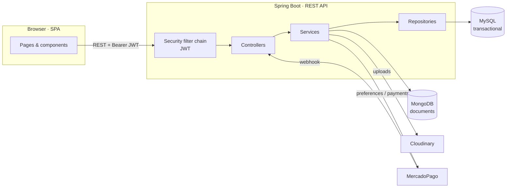
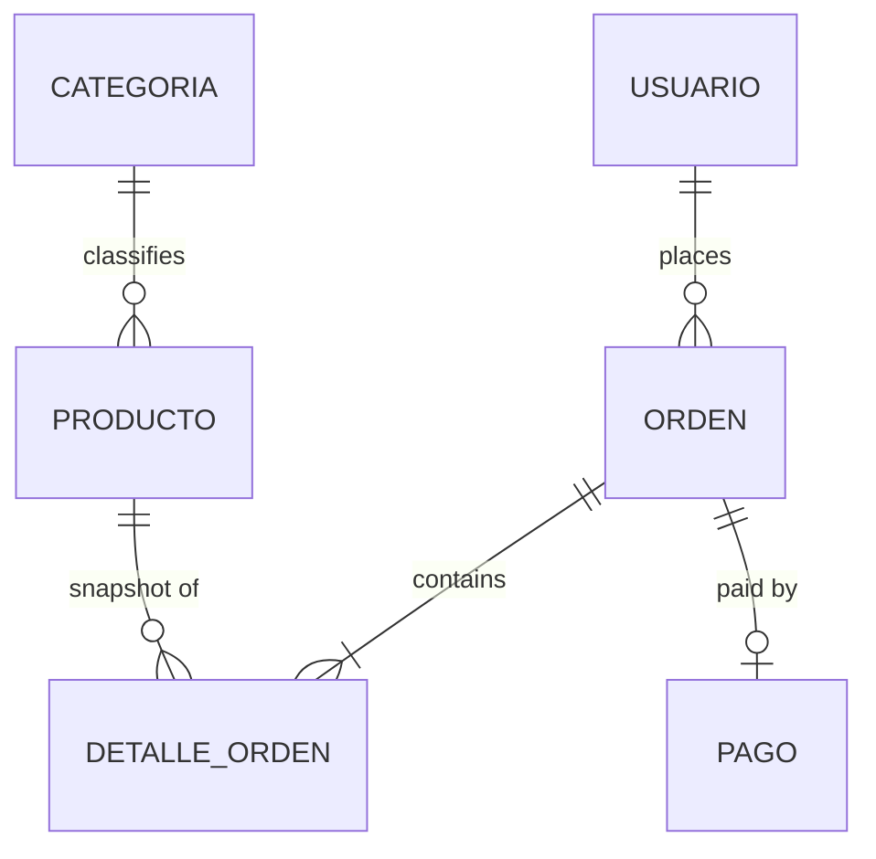
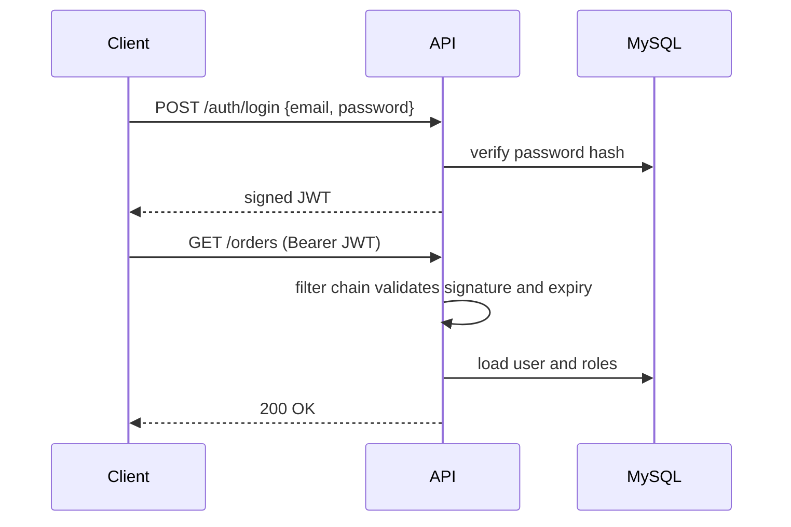
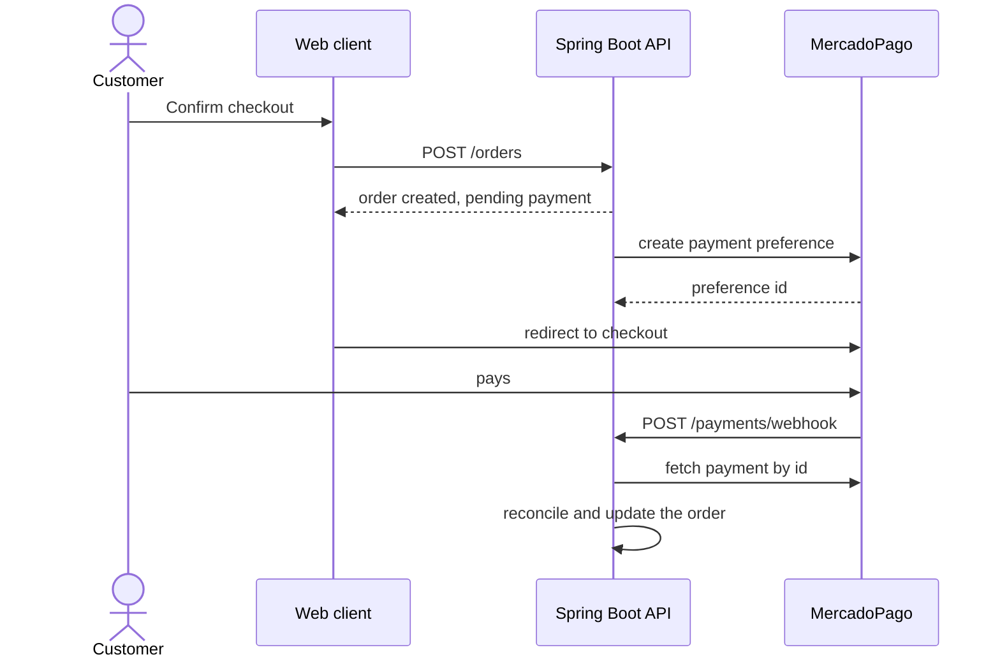

# 🛒 Yacomo — E-Commerce Platform

**Full-stack e-commerce: Spring Boot REST API with JWT authentication, MySQL and MongoDB persistence, audited entities, MercadoPago checkout, Cloudinary media and server-side PDF generation.**


**Live:** https://proyecto-yacomo.vercel.app

> `TODO: screenshot of the storefront here, the way foodstore does it.`
> `Put images under docs/screenshots/ and reference them with a relative path.`

> [!NOTE]
> **Team project.** Built by `TODO: names`. I wrote most of the backend:
> `TODO: name the modules that were yours — auth, orders, payments, whichever they were.`
> Being specific here is fairer to everyone and easier to defend in an interview.

## Contents

- [Overview](#overview)
- [Features](#features)
- [Tech stack](#tech-stack)
- [Architecture](#architecture)
- [Domain model](#domain-model)
- [Authentication and authorization](#authentication-and-authorization)
- [Payments with MercadoPago](#payments-with-mercadopago)
- [Auditing with Envers](#auditing-with-envers)
- [Getting started](#getting-started)
- [Environment variables](#environment-variables)
- [Testing](#testing)
- [Project structure](#project-structure)

---

## Overview

> `TODO: two or three sentences. What does Yacomo sell, who is it for, and what does`
> `the whole flow look like from browsing to a delivered order? A reader should know`
> `what the product is before they read a single technology name.`

The repository holds two independent applications:

| App | Path | Stack |
| --- | --- | --- |
| REST API | `Backend/BackendE_Commerce/` | Java 21, Spring Boot 3.5, Spring Data JPA, MySQL, MongoDB |
| Web client | `Frontend/` | `TODO: React? Vite? plain JS? state management? styling?` |

> [!NOTE]
> **Naming convention.** `TODO: if domain code, routes and UI copy are in Spanish,`
> `add a glossary table here mapping the terms a reader will hit in the codebase —`
> `the foodstore README does this and it makes the code readable to anyone.`

---

## Features

> `TODO: group these the way the product actually works. The shape below is a starting`
> `point; delete what does not exist and add what does.`

**Storefront**

- `TODO: catalogue, categories, search, product detail, cart`

**Checkout and payments**

- MercadoPago checkout; payment state is confirmed by the backend, not by the browser.
- `TODO: which payment methods, and what happens to stock when an order is placed`

**Back office**

- `TODO: product and category management, order handling, roles`
- Server-side PDF generation for `TODO: invoices? order summaries?`

**Security**

- Stateless authentication with signed JWTs.
- Role-based authorization enforced server-side by Spring Security.
- Bean Validation on every request payload.
- `TODO: password hashing algorithm, token lifetimes, refresh flow if there is one`

---

## Tech stack

### Backend

| Technology | Version | Role in this project |
| --- | --- | --- |
| [Spring Boot](https://spring.io/projects/spring-boot) | 3.5.5 | Application framework, auto-configuration, embedded server |
| Java | 21 | Language, via the Gradle toolchain |
| [Spring Web](https://docs.spring.io/spring-framework/reference/web.html) | — | REST controllers and the HTTP layer |
| [Spring Security](https://spring.io/projects/spring-security) | — | Authentication filter chain and method-level authorization |
| [jjwt](https://github.com/jwtk/jjwt) | 0.11.5 | Signing and verifying JSON Web Tokens |
| [Spring Data JPA](https://spring.io/projects/spring-data-jpa) + Hibernate | — | ORM over MySQL: entities, repositories, transactions |
| [MySQL](https://www.mysql.com) | 8 | Relational store for transactional data |
| [Spring Data MongoDB](https://spring.io/projects/spring-data-mongodb) | — | Document store for `TODO: what exactly` |
| [Spring Data Envers](https://spring.io/projects/spring-data-envers) | — | Revision history for audited entities |
| [Spring Validation](https://docs.spring.io/spring-framework/reference/core/validation/beanvalidation.html) | — | Declarative request validation |
| [MercadoPago SDK](https://github.com/mercadopago/sdk-java) | 2.1.19 | Payment preferences, payment lookup, webhook handling |
| [Cloudinary](https://cloudinary.com) | 1.39.0 | Product image storage and delivery |
| [Spring Mail](https://docs.spring.io/spring-boot/reference/io/email.html) | — | Transactional email |
| [OpenPDF](https://github.com/LibrePDF/OpenPDF) | 1.3.30 | Server-side PDF generation |
| [Lombok](https://projectlombok.org) | — | Removes boilerplate from entities and DTOs |
| [JUnit 5](https://junit.org/junit5/) + Spring Boot Test | — | Test suite |

### Frontend

> `TODO: same table shape as above — technology, version, and what it does here.`
> `Deployed on Vercel.`

---

## Architecture



> `TODO: describe the backend package layout — controller / service / repository /`
> `entity / dto, or whatever it actually is. Three or four lines, plus a tree if it helps.`

### Design decisions

This is the section worth reading. Each of these cost something.

**Stateless authentication with JWT.** No server-side sessions, so any instance can serve any request and the auth layer scales horizontally for free. The cost is revocation: a signed token stays valid until it expires.
`TODO: how you dealt with that — short-lived access tokens, a refresh flow, a denylist, or an accepted limitation. Saying "accepted for this scope" is a perfectly good answer.`

**Two databases side by side.** Orders, payments, users and stock live in MySQL, where foreign keys and transactions are enforced by the database itself.
`TODO: what went into MongoDB and why it did not belong in MySQL. This is the decision a reviewer will ask about first. If the honest answer is "we wanted to work with a document store", write that — it reads better than a rationalisation.`
The cost is operational: two stores to run and back up, and no referential integrity across the boundary.

**Payment state decided server-side.** The frontend never tells the API that an order is paid. MercadoPago notifies the backend, and the backend reconciles that against its own records before advancing anything.

**Media offloaded to Cloudinary.** Images never touch the application server or the database, so the API stays stateless and image traffic does not compete with API traffic.

---

## Domain model



> `TODO: replace this with the real entities and relationships. Then add two or three`
> `bullets underneath explaining the non-obvious ones, the way the foodstore README does.`

---

## Authentication and authorization



> `TODO: correct the endpoints and add the role table — which role can do what.`
> `A small capability matrix is worth more than a paragraph.`

---

## Payments with MercadoPago



> [!IMPORTANT]
> `TODO: the two questions a reviewer will ask about this flow:`
> `1. Do you verify the webhook signature? Webhook endpoints are public.`
> `2. Is the handler idempotent? Delivery is not exactly-once, so the same event can`
> `   arrive twice, and events can arrive out of order.`
> `Whatever the answers are, write them here. If either is "no", put it under Known`
> `limitations instead — that is a stronger README than one that stays silent.`

Sandbox test data is in `DATOS-PRUEBAS-MP.txt`.

---

## Auditing with Envers

Spring Data Envers writes a revision row every time an audited entity changes, so the state of an order or a product at any past moment can be reconstructed.

In an application handling money this is not decoration: when a customer disputes a price or an order state, the answer has to come from recorded history rather than from whatever the row happens to say today.

The cost is write volume and schema weight, since every audited table gets a shadow table.

> `TODO: which entities are audited, and whether the revision history is exposed`
> `anywhere in the UI or only queryable from the backend.`

---

## Getting started

### Prerequisites

| Tool | Version | Purpose |
| --- | --- | --- |
| JDK | 21 | Backend |
| MySQL | `TODO` | Relational database |
| MongoDB | `TODO` | Document database |
| Node.js | `TODO` | Frontend |
| ngrok | — | *Optional:* public URL so MercadoPago can reach the webhook locally |

### Backend

```bash
cd Backend/BackendE_Commerce
cp .env.example .env     # TODO: create this file if it does not exist
./gradlew bootRun
```

The API runs at `http://localhost:8080`. `TODO: confirm the port and whether there is a context path such as /api/v1.`

Seed the catalogue:

```bash
mysql -u <user> -p <database> < productos_seed.sql
```

### Frontend

```bash
cd Frontend
npm install
npm run dev
```

### API collection

Import the Postman collection from `JSON_POSTMAN/` to explore the endpoints.

> `TODO: a short table of endpoint groups — auth, products, cart, orders, payments,`
> `admin — with one line each. Nobody imports a Postman collection just to find out`
> `what an API does.`

---

## Environment variables

| Variable | Description |
| --- | --- |
| `SPRING_DATASOURCE_URL` | MySQL JDBC connection string |
| `SPRING_DATASOURCE_USERNAME` | MySQL user |
| `SPRING_DATASOURCE_PASSWORD` | MySQL password |
| `SPRING_DATA_MONGODB_URI` | MongoDB connection string |
| `JWT_SECRET` | JWT signing key |
| `JWT_EXPIRATION` | Access token lifetime |
| `MP_ACCESS_TOKEN` | MercadoPago access token — use a `TEST-` token locally |
| `MP_WEBHOOK_SECRET` | Webhook signature secret |
| `CLOUDINARY_URL` | Cloudinary credentials |
| `MAIL_USERNAME` / `MAIL_PASSWORD` | SMTP credentials |

> `TODO: replace these with the real property names from application.properties.`

> [!WARNING]
> No real credentials belong in the repository. Check that `application.properties`
> reads from the environment and that nothing secret was ever committed, including in
> the history.

---

## Testing

```bash
cd Backend/BackendE_Commerce
./gradlew test
```

> `TODO: what the suite covers, whether it uses an in-memory or containerised database,`
> `and whether MercadoPago is mocked. If coverage is thin, say so under Known limitations.`

---

## Project structure

```
PROYECTO_YACOMO/
├── Backend/BackendE_Commerce/   Spring Boot API
│   └── src/main/java/...        TODO: package layout
├── Frontend/                    Web client
├── JSON_POSTMAN/                Postman collection
├── productos_seed.sql           Catalogue seed data
└── DATOS-PRUEBAS-MP.txt         MercadoPago sandbox test data
```

---

## Known limitations

> `TODO: three or four honest lines. What is missing, what would not scale, what you`
> `would build differently now. A README that names its limitations reads as more`
> `competent than one that claims none, and in an interview this is the section people`
> `ask about.`

A known one to start from: `spring-boot-starter-web` is declared twice in `build.gradle`. Harmless, but worth removing.
